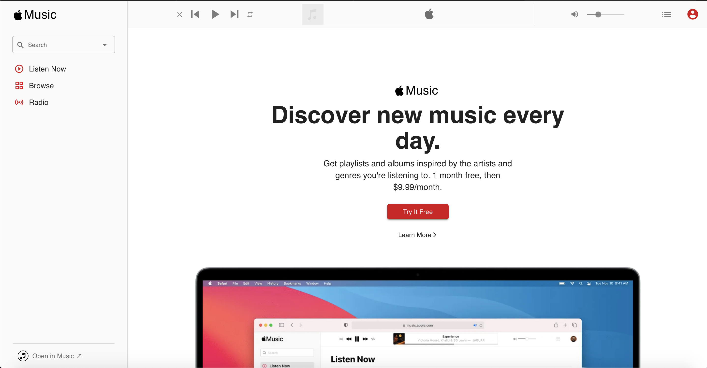

# Apple Music App Clone
A website showcases art collection, using react libraries.
https://whispering-thicket-41770.herokuapp.com

## Table of contents
* [Getting Started](#getting-started)
* [Feature](#feature)
* [Technology](#technology)
* [License](#license)
* [Acknowledgements](#acknowledges)

## Getting Started

These instructions will get you a copy of the project up and running on your local machine for development and testing purposes. See deployment for notes on how to deploy the project on a live system.

### Prerequisites

After having cloned or downloaded the project, open it in suitable platform (suggested: [Visual Studio Code](https://code.visualstudio.com))

### Installing

#### For Mac
* Install [Node.js](https://nodejs.org/en/): 
Open the Terminal and type 
```
brew install node
```
Clone or download the project, open it on a suitable platform (suggested: [Visual Studio Code](https://code.visualstudio.com))

* Enter these command lines:
```
npm install
npm start
```
The page will reload if you make edits.<br />
Website will be shown on your browser, running on your local host.

## Feature

This website is:
* A clone of the Apple Music web app
* User can navigate to different pages with the side menu and browse music playlists

## Page View
### Browse Page

### Listen Now Page

### Radio Page

### Categories Page


## Technology

* [React](https://reactjs.org)
* [Material-UI](https://material-ui.com)
* [Create React App](https://github.com/facebook/create-react-app)
* [Web Spotify API Node](https://github.com/thelinmichael/spotify-web-api-node).
* [Web Spotify API JS](https://jmperezperez.com/spotify-web-api-js/).

## License

This project is licensed under the MIT License - see the [LICENSE](LICENSE) file for details

